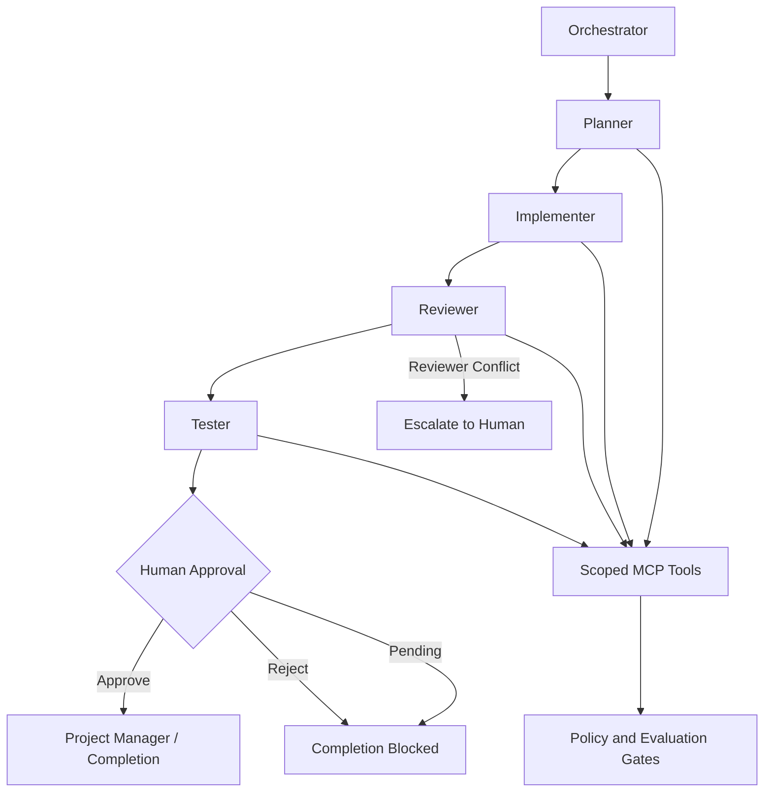

# Orchestration Diagram

## Workflow

The default governed workflow is:

**Planner → Implementer → Reviewer → Tester → Human Approval → Completion**

Automated review and testing do not authorize final completion by themselves. After the Tester finishes, the workflow records an explicit human decision.

- `approve` → completion is authorized.
- `reject` → completion is blocked.
- `pending` → completion remains blocked.
- Conflicting reviewer verdicts trigger escalation to a human.

The orchestrator also applies scoped tool grants, deterministic validation, token budgets, request timeouts, bounded retries, and audit/transcript logging.

The Human Approval gate ensures that successful automated agent output cannot silently become final workflow completion without an explicit human decision.